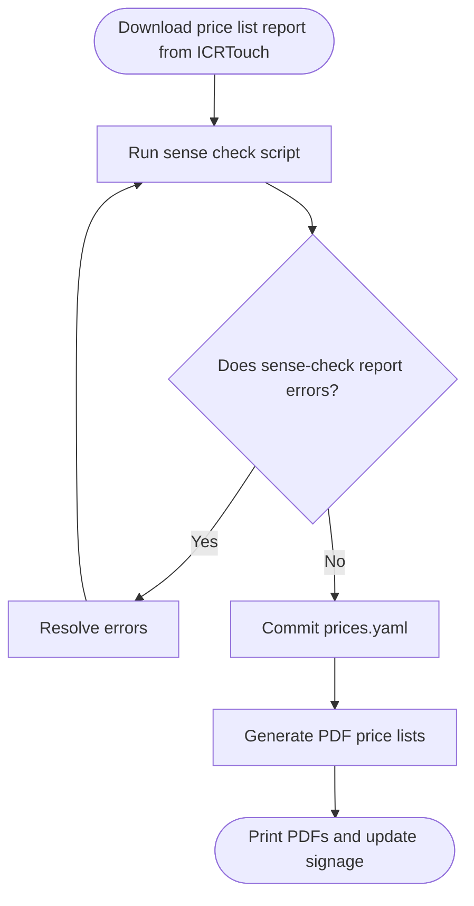

# Bar Price List Generator

This repository contains all the code to produce the price list for the bar at St Mary's Church Whitkirk Community Centre.

## Developing

We use [pre-commit](https://pre-commit.com/) to automate some sense checks. Download this, then run

```
pre-commit install
```

to make sure you have the right commit hooks in place.

## Using this repository



### Checking our price list matches the till

#### Getting the source price report

You will need access to ICRTouch for this.

1. Sign in to ICRTouch
1. Go to 'Reports/View'
1. Generate a 'PLU Price List' CSV report for All Groups, All Departments and All Price Levels
1. Put it in the `data` folder

#### Running a sense check

To sense check the till's PLU report against the price list data, run

```
poetry run python app.py check FILENAME
```

### Generating updated price list documentation

#### Update the price list data

All the price data lives in the `data/prices.yaml` file.

#### Generating PDF files for print

Run

```
poetry run python app.py build
```

to spit out PDF files into the `outputs` folder.

This command also generates `outputs/prices.csv` with one row per listed item and columns for `name`, `price`, and `category`.
